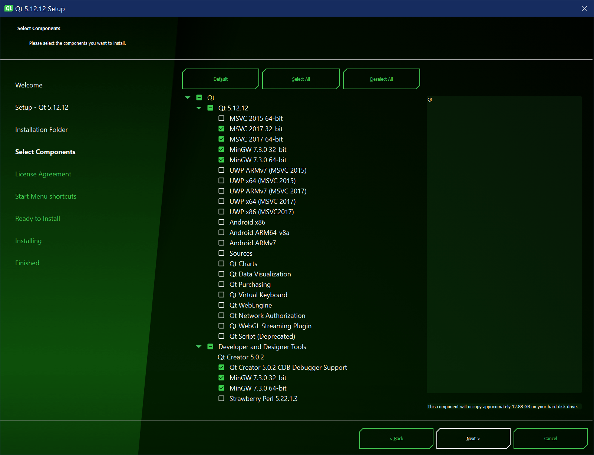
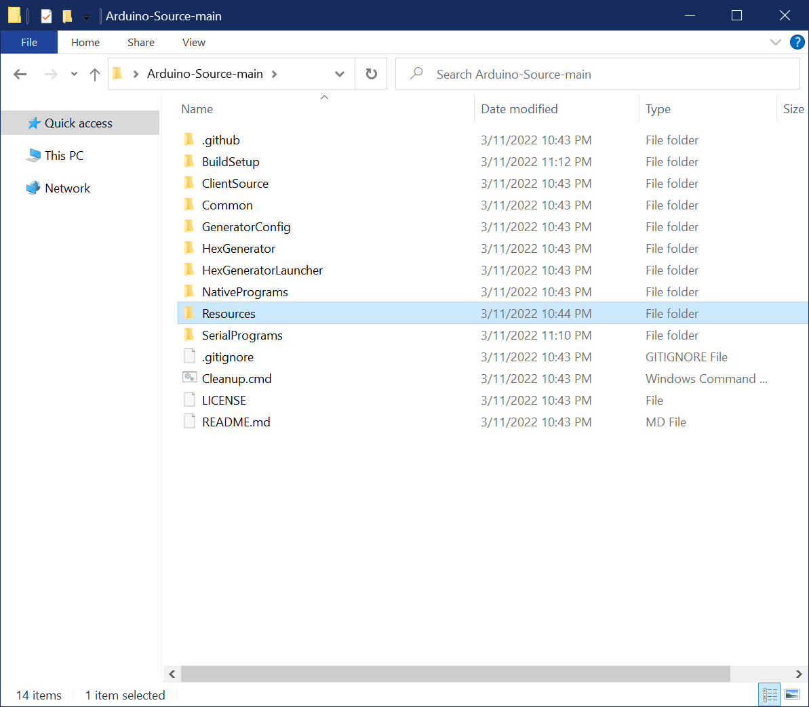

# Serial Programs

Source code for the "Computer Control" programs.

# How to Build - Windows

**Build Tools:**

1. Install Visual Studio 2019:
    1. [Download Page](https://docs.microsoft.com/en-us/visualstudio/releases/2019/release-notes)
    2. Make sure you select the C++ development tools.
2. Install Windows Development SDK:
    1. [Download Page](https://developer.microsoft.com/en-us/windows/downloads/windows-sdk/)
3. Install CMake:
    1. [Download Page](https://cmake.org/download/)
    2. When prompted select, "Add CMake to the system PATH for all users".
4. Install Qt 5.12.12:
    1. [Download the offline installer.](https://www.qt.io/offline-installers) [Direct Download Link](https://download.qt.io/official_releases/qt/5.12/5.12.12/qt-opensource-windows-x86-5.12.12.exe)
    2. Disconnect from the internet. This is needed to keep it from forcing you to create an account.
    3. Run the installer.
    4. When prompted for components select all of the following:
        - Qt 5.12.12
            - MSVC 2017 32-bit
            - MSVC 2017 64-bit
            - MinGW 7.3.0 32-bit
            - MinGW 7.3.0 64-bit
        - Developer and Designer Tools
            - Qt Creator 5.0.2 CDB Debugger Support
            - MinGW 7.3.0 32-bit
            - MinGW 7.3.0 64-bit

**Setup:**

1. Clone this repo.
2. Clone the [Packages Repo](https://github.com/PokemonAutomation/Packages).
3. In the `Packages` repo, copy the `SerialPrograms/Resources` folder into the root of the `Arduino-Source` repo.

4. Open Qt Creator.
5. Click on `Projects` -> `Open`.
6. Navigate to [`SerialPrograms`](GeneratorSource) and select `CMakeLists.txt`.`.
7. It will then ask you to configure the project. Select `Desktop Qt 5.12.12 MSVC2017 64bit`*.
8. At the bottom left corner, click on the little monitor and select `Release with Debug Information`.
9. Click the green arrow to compile and launch the program.

*Even though it says "MSVC2017", it will be using your MSVC 2019 installation instead.

**Note that you will not be able to feasibly run with a debugger attached. This is because Qt Creator places a breakpoint on every single thrown exception and this application heavily uses exceptions even for non-error situations. So the debugger will break on literally everything. If you know how to disable break on exceptions, please let us know.

